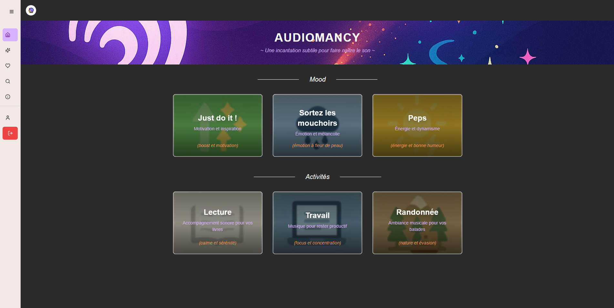
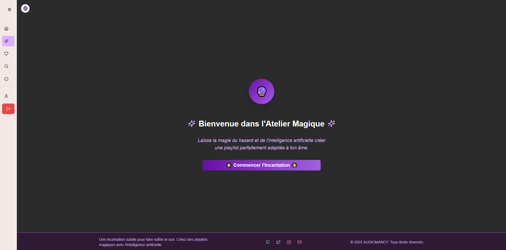
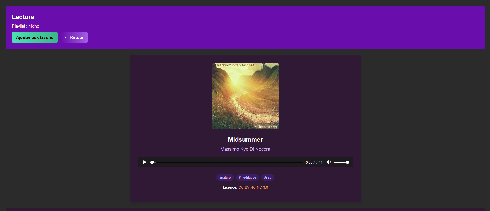

# Audiomancy

 


**Audiomancy** est une plateforme web basée sur l’IA pour la génération, la gestion et la lecture de playlists musicales. Elle combine :

- un **backend Python FastAPI** pour la logique métier et les intégrations IA,
- un **frontend Next.js/React/TypeScript** pour l’expérience utilisateur,
- des **fonctions serverless Azure** pour la gestion des tokens et services cloud.

Audiomancy permet de créer automatiquement des playlists adaptées à un thème ou une ambiance, de rechercher des morceaux libres de droits via Jamendo, et d’offrir une expérience de lecture fluide et moderne.

* * *

## Sommaire

- [Fonctionnalités](#fonctionnalit%C3%A9s)
- [Architecture](#architecture)
- [Installation](#installation)
- [Utilisation](#utilisation)
- [Tests](#tests)
- [Équipe](#%C3%A9quipe)
- [Licence](#licence)
- [Annexe](#annexe)

* * *

## Fonctionnalités

- Génération de playlists musicales via IA
- Recherche et lecture de morceaux libres de droits (API Jamendo)
- Gestion des favoris utilisateurs
- Authentification et sessions sécurisées
- Intégration avec **Azure Speech** pour synthèse et reconnaissance vocale
- Interface moderne et responsive (mobile & desktop)

* * *

## Arborescence 

```bash
.
├── LICENSE
├── azure_functions/    # Fonctions serverless Azure
├── backend/            # API FastAPI + logique métier
├── frontend/           # Application Next.js/React
├── img_readme/         # Images pour le README
└── README.md
```

## Architecture

### Backend (`backend/`)

- **Python 3.13+ / FastAPI**
- Endpoints API, logique métier, intégration IA
- Modules principaux :
    - `core/` : configuration, logging, sécurité
    - `models/` : modèles Pydantic pour validation & documentation
    - `routes/` : endpoints API
    - `services/` : IA, Jamendo, Azure
    - `utils/` : utilitaires, formatage, licences
    - `tests/` : tests unitaires et d’intégration

### Frontend (`frontend/`)

- **Next.js 15 / React / TypeScript / Tailwind**
- Gestion des états, appels API, composants réutilisables
- Organisation : `components/`, `pages/`, `contexts/`, `services/`, `tests/`

### Azure Functions (`azure_functions/`)

- Fonctions serverless pour services cloud et tokens
- Exemple : génération de token pour Azure Speech, synchronisation playlists
- Dépendances gérées via `requirements.txt`

* * *

## Installation

### Prérequis

- Python 3.13+  
- Node.js 22+  
- Docker (optionnel)  
- Azure CLI (optionnel)  
- Fichiers `.env` pour frontend et backend (développement local)

⚠️ Des fichiers `.env.example` sont fournis dans `backend/` et `frontend/`. Copiez-les en `.env` et complétez les clés nécessaires (Jamendo, OpenAI, Azure, etc.).

### Backend

```bash
cd backend
python -m venv venv
source venv/bin/activate  # Windows : venv\Scripts\activate
pip install -r requirements.txt
```

### Frontend

```bash
cd frontend
npm install  # ou pnpm install
```

### Azure Functions

```bash
cd azure_functions
pip install -r requirements.txt
npm install -g azurite
npm install -g azure-functions-core-tools@4 --unsafe-perm true
```

---

## Utilisation

Pour exécuter Audiomancy en environnement local, plusieurs services doivent tourner en parallèle.  
Il est recommandé d’ouvrir différentes fenêtres ou onglets de terminal pour chaque service.

### 1. Lancer le backend (FastAPI)

```bash
cd backend
uvicorn app.main:app --reload
```

- API disponible : [http://localhost:8000](http://localhost:8000)  
- Documentation Swagger : [http://localhost:8000/docs](http://localhost:8000/docs)

### 2. Lancer le frontend (Next.js)

```bash
cd frontend
npm run dev
```

- Application disponible : [http://localhost:3000](http://localhost:3000)

### 3. Lancer l’émulateur Azure Storage (Azurite)

```bash
cd azure_functions
azurite
```

- Service accessible par défaut : [http://127.0.0.1:10000](http://127.0.0.1:10000)

### 4. Lancer les Azure Functions

```bash
cd azure_functions
func start
```

- Les fonctions seront exécutées localement et prêtes à interagir avec le backend et le stockage émulé

⚡ Une fois ces quatre services en route, Audiomancy sera pleinement fonctionnelle.

* * *
## Tests

### Backend

```bash
cd backend
pytest
```

### Frontend

```bash
cd frontend
npm run test
```
* * *

## Équipe

| Nom | Rôle | GitHub |
| --- | --- | --- |
| Benjamin | Backend , Architecture, Configuration | [@benjsant](https://github.com/benjsant)  |
| Aurelien R | Frontend, UI, MongoDB/Utilisateur | [@aruide](https://github.com/aruide)  |
| Aurelien L | Azure, IA, MongoDb/Favoris | [@Aurelien-L](https://github.com/Aurelien-L)|

* * *

## Licence

Ce projet est sous licence [MIT](LICENSE).

* * *

## Annexe 

### Page Accueil: 


### Page Generation: 


### Lecteur de Musique:
