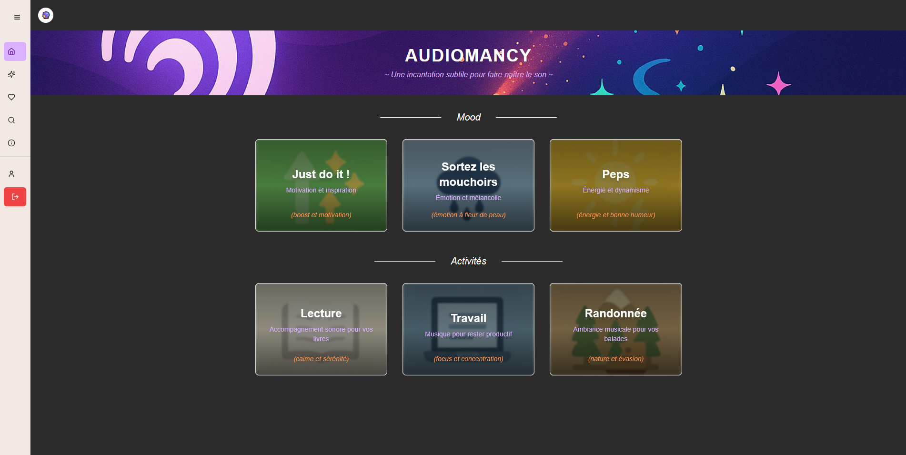
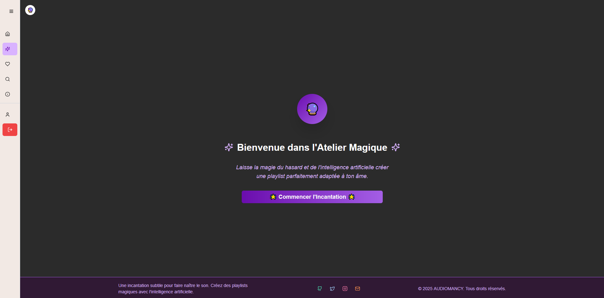
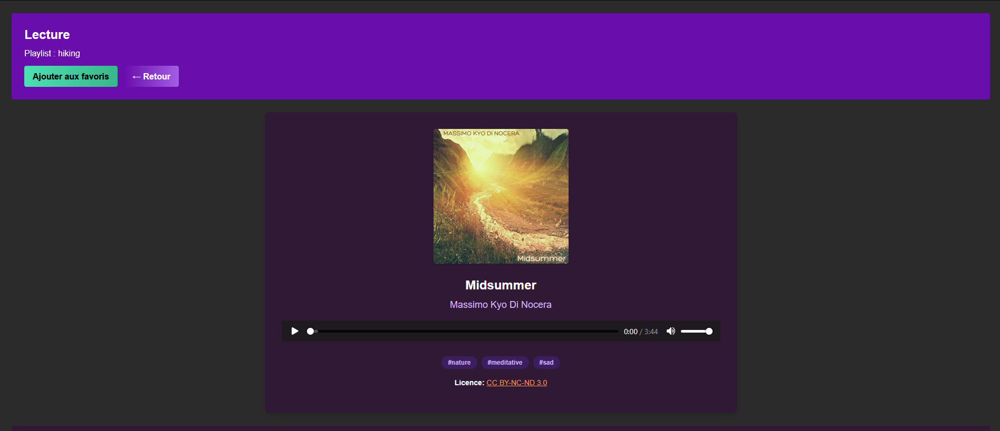

# Audiomancy

      


**Audiomancy** est une plateforme web de generation et de lecture de playlists musicales assistee par IA. Elle combine :

- un **backend Python FastAPI** (logique metier, integration IA, API Jamendo),
- un **frontend Next.js / React / TypeScript** (interface utilisateur),
- une base **MongoDB** pour les utilisateurs, favoris et cache,
- un stack **monitoring** complet (Prometheus, Grafana, Loki, AlertManager).

L'application genere automatiquement des playlists adaptees a un theme ou une ambiance via un agent IA (DeepSeek), recherche des morceaux libres de droits sur Jamendo, et offre une experience de lecture moderne.

---

## Sommaire

- [Fonctionnalites](#fonctionnalites)
- [Architecture](#architecture)
- [Installation](#installation)
- [Utilisation](#utilisation)
- [Tests](#tests)
- [Monitoring](#monitoring)
- [Equipe](#equipe)
- [Licence](#licence)
- [Annexe](#annexe)

---

## Fonctionnalites

- Generation de playlists musicales via un agent IA (DeepSeek + recherche web)
- Recherche et lecture de morceaux libres de droits (API Jamendo)
- Gestion des favoris et playlists utilisateur
- Authentification par cle API
- Cache MongoDB avec expiration automatique (TTL)
- Monitoring temps reel (Prometheus, Grafana, Loki)
- Interface responsive (mobile & desktop)

---

## Architecture

```
.
├── backend/                       # API FastAPI
│   ├── app/
│   │   ├── core/                  # Config, DB, securite, scheduler, middleware
│   │   ├── models/                # Modeles Pydantic
│   │   ├── routes/                # Endpoints API
│   │   ├── services/              # IA (agent, DeepSeek), Jamendo, users, favoris
│   │   ├── utils/                 # Cache, formatage, licences
│   │   └── tests/                 # Tests unitaires (pytest)
│   └── requirements.txt
├── frontend/                      # Application Next.js
│   ├── app/                       # Pages et routes API
│   ├── components/                # Composants UI (Radix, Tailwind)
│   ├── context/                   # Contextes React (auth, favoris, generation)
│   ├── services/                  # Appels API cote client
│   └── package.json
├── monitoring/                    # Stack monitoring
│   ├── prometheus/                # Regles d'alerte, config scrape
│   ├── grafana/                   # Dashboards et provisioning
│   ├── loki/                      # Agregation de logs
│   ├── alertmanager/              # Alertes (Discord)
│   └── ...
├── docker-compose.yml             # App (MongoDB + Backend + Frontend)
├── docker-compose.monitoring.yml  # Stack monitoring (9 services)
└── README.md
```

### Backend

- **Python 3.13+ / FastAPI / Motor (async MongoDB)**
- Agent IA ReAct (DeepSeek) avec recherche web pour la generation de tags
- API Jamendo pour la recuperation de morceaux
- Cache MongoDB avec TTL (expiration automatique a 1 jour)
- Metriques Prometheus (requests, cache hits, duree)

### Frontend

- **Next.js 15 / React 18 / TypeScript / Tailwind CSS**
- Composants UI bases sur Radix UI
- Proxy API integre (routes `/api/*`)
- Theme sombre/clair

### Base de donnees

- **MongoDB 7.0** — collections : `user`, `favorite`, `cache`, `categories_du_jour`
- Index TTL sur la collection `cache` (expiration automatique)
- Les comptes utilisateurs sont permanents (pas de TTL)

---

## Installation

### Prerequis

- **Docker** et **Docker Compose** (methode recommandee)
- Fichier `.env` dans `backend/` avec les cles API (Jamendo, DeepSeek, etc.)
- Fichier `.env.local` dans `frontend/` avec `FASTAPI_API_KEY`

### Lancement avec Docker (recommande)

```bash
# Lancer l'application + monitoring (12 containers)
docker compose -f docker-compose.yml -f docker-compose.monitoring.yml up -d

# Verifier l'etat
docker compose -f docker-compose.yml -f docker-compose.monitoring.yml ps

# Arreter tout
docker compose -f docker-compose.yml -f docker-compose.monitoring.yml down

# Arreter + supprimer les volumes (reset complet)
docker compose -f docker-compose.yml -f docker-compose.monitoring.yml down -v
```

Le frontend est lance en **mode production** par defaut (`next build` + `next start`).
Pour le mode developpement :

```bash
NODE_ENV=development docker compose -f docker-compose.yml -f docker-compose.monitoring.yml up -d
```

### Installation manuelle (sans Docker)

**Backend :**
```bash
cd backend
python -m venv venv
source venv/bin/activate
pip install -r requirements.txt
uvicorn app.main:app --reload
```

**Frontend :**
```bash
cd frontend
pnpm install
pnpm dev
```

Necessite une instance MongoDB accessible (configurer `MONGO_HOST` / `MONGO_PORT` dans le `.env`).

---

## Utilisation

| Service | URL |
|---------|-----|
| Frontend | http://localhost:3000 |
| Backend API | http://localhost:8000 |
| Swagger (docs API) | http://localhost:8000/docs |

---

## Tests

### Backend (85 tests)

```bash
cd backend
python -m pytest app/tests/ -v
```

### Frontend

```bash
cd frontend
pnpm test
```

---

## Monitoring

| Service | URL | Role |
|---------|-----|------|
| Prometheus | http://localhost:19090 | Metriques |
| Grafana | http://localhost:19091 | Dashboards |
| Loki | http://localhost:19100 | Logs |
| AlertManager | http://localhost:19093 | Alertes |

Le stack monitoring comprend 9 services : Prometheus, Grafana, Loki, Promtail, AlertManager, AlertManager-Discord, Pushgateway, Chaosd et Chaosd-UI.

---

## Equipe

| Nom | Role | GitHub |
| --- | --- | --- |
| Benjamin | Backend, Architecture, Configuration | [@benjsant](https://github.com/benjsant) |
| Aurelien R | Frontend, UI, MongoDB/Utilisateur | [@aruide](https://github.com/aruide) |
| Aurelien L | Azure, IA, MongoDB/Favoris | [@Aurelien-L](https://github.com/Aurelien-L) |

---

## Licence

Ce projet est sous licence [MIT](LICENSE).

---

## Annexe

### Page Accueil


### Page Generation


### Lecteur de Musique

