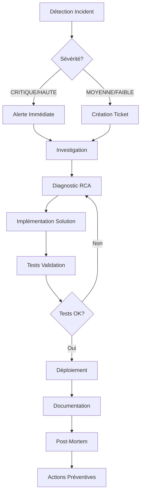

# Processus de Gestion d'Incidents - Audiomancy

Processus formalisé pour la détection, résolution et documentation des incidents techniques (Compétence C21).

---

## 1. Vue d'Ensemble

Ce processus définit comment l'équipe Audiomancy détecte, résout et documente les incidents techniques dans une approche MLOps, en conformité avec le RGPD.

### Objectifs
- ⏱️ Réduire le temps de résolution (MTTR)
- 📊 Améliorer la traçabilité des incidents
- 🔄 Feedback loop pour amélioration continue
- 🛡️ Conformité RGPD dans la gestion des incidents

---

## 2. Classification des Incidents

### Niveaux de Sévérité

| Sévérité | Impact | Exemples | SLA Réponse | SLA Résolution |
|----------|--------|----------|-------------|----------------|
| **CRITIQUE** | Service totalement indisponible | - Backend down<br>- MongoDB inaccessible<br>- Fuite de données | < 15 min | < 2h |
| **HAUTE** | Fonctionnalité majeure cassée | - Génération AI en échec<br>- Login impossible<br>- DeepSeek timeout constant | < 30 min | < 4h |
| **MOYENNE** | Dégradation de performance | - Latence API > 5s<br>- Cache hit ratio < 50%<br>- Logs non collectés | < 1h | < 8h |
| **FAIBLE** | Impact mineur | - Typo dans UI<br>- Warning logs<br>- Test flaky | < 4h | < 24h |

### Catégories

- **INFRA**: Problèmes infrastructure (Docker, MongoDB, réseau)
- **API**: Erreurs backend/frontend
- **ML/AI**: Problèmes modèle DeepSeek ou génération playlists
- **DATA**: Problèmes cache MongoDB, RGPD
- **SECURITY**: Tentatives d'intrusion, failles de sécurité
- **PERFORMANCE**: Latence, mémoire, CPU

---

## 3. Workflow de Gestion d'Incident



---

## 4. Étapes Détaillées

### 4.1 Détection

**Sources de détection:**
- 🔔 **Alertes Prometheus/AlertManager** (automatique)
  - ServiceDown, HighErrorRate, HighLatency
  - Consulter: http://localhost:19093
- 📊 **Dashboards Grafana** (monitoring actif)
  - Backend, Frontend, Incidents Reporting
  - Consulter: http://localhost:19091
- 📝 **Logs Loki** (investigation)
  - Recherche `{container_name=~"audiomancy.*"} |= "error"`
  - Consulter: http://localhost:19091/explore
- 👤 **Signalement utilisateur** (via email/support)
- 🧪 **Tests CI/CD en échec** (GitHub Actions)

### 4.2 Création Incident

**Automatique (via script):**
```bash
cd monitoring/incidents
./create_incident.sh
```

**Manuel (via template):**
```bash
cp monitoring/incidents/templates/INCIDENT_TEMPLATE.md \
   incidents/in_progress/INC-2025-02-04-001.md
```

**Format ID incident**: `INC-YYYY-MM-DD-NNN`
- Exemple: `INC-2025-02-04-001`

### 4.3 Investigation

**Checklist diagnostique:**
1. ✅ Consulter les **métriques Prometheus**
   - Latence, taux d'erreur, CPU, mémoire
   - Query: `rate(http_requests_total{status_code=~"5.."}[5m])`

2. ✅ Analyser les **logs Loki**
   - Filtrer par container, niveau (error/warning)
   - Rechercher stack traces

3. ✅ Vérifier **l'état des services**
   ```bash
   docker-compose ps
   curl http://localhost:8000/health
   ```

4. ✅ Reproduire en **environnement local**
   ```bash
   docker-compose down
   docker-compose up -d
   # Tester le scénario problématique
   ```

5. ✅ Consulter le **Runbook**
   - Voir `docs/incidents/RUNBOOK-COMMON-ISSUES.md`

### 4.4 Root Cause Analysis (RCA)

Utiliser la méthode des **5 Pourquoi**:

**Exemple:**
```
Problème: Génération playlist échoue avec timeout

Pourquoi 1? DeepSeek API ne répond pas dans les 30s
Pourquoi 2? Le modèle prend > 45s pour générer les tags
Pourquoi 3? Le prompt est trop long (2000+ tokens)
Pourquoi 4? Aucune limitation de taille de prompt côté frontend
Pourquoi 5? Validation manquante dans le formulaire utilisateur

→ CAUSE RACINE: Pas de validation de longueur du prompt utilisateur
```

### 4.5 Implémentation Solution

**Workflow Git:**
```bash
# Créer branche depuis main
git checkout main
git pull
git checkout -b fix/INC-2025-02-04-001-deepseek-timeout

# Coder la correction
# Exemple: Ajouter validation prompt max 500 chars

# Commiter avec référence incident
git add .
git commit -m "fix(ai): limit prompt to 500 chars to prevent DeepSeek timeout

Resolves INC-2025-02-04-001

- Add validation in frontend form
- Add server-side check in ai_routes.py
- Update error message for user clarity"

# Pousser et créer PR
git push -u origin fix/INC-2025-02-04-001-deepseek-timeout
```

### 4.6 Tests de Validation

**Checklist tests:**
1. ✅ Tests unitaires passent
   ```bash
   docker exec audiomancy-backend pytest
   ```
2. ✅ Tests d'intégration passent
3. ✅ **Reproduire le scénario d'incident** → doit être corrigé
4. ✅ **Tests de régression** → pas de nouvelles erreurs
5. ✅ **Vérifier les métriques** après déploiement
   - `deepseek_errors_total` doit diminuer
   - `http_requests_total{status_code="500"}` doit diminuer

### 4.7 Déploiement

**En développement:**
```bash
docker-compose down
docker-compose up -d --build
```

**En production (via CI/CD):**
- Merge PR dans `main`
- Pipeline GitHub Actions déploie automatiquement

### 4.8 Documentation Incident

**Sections obligatoires** (selon template):
1. **Informations générales**
   - ID, dates, sévérité, catégorie
2. **Description et impact**
   - Symptômes, utilisateurs impactés, données RGPD
3. **Analyse technique**
   - Logs Loki, métriques Prometheus, stack traces
4. **Cause racine (RCA)**
   - Méthode des 5 Pourquoi
5. **Solution appliquée**
   - Code diff, commit Git, tests
6. **Conformité RGPD**
   - Données personnelles exposées? Notification CNIL?
7. **Actions préventives**
   - Monitoring, alertes, tests

**Déplacer l'incident résolu:**
```bash
mv incidents/in_progress/INC-2025-02-04-001.md \
   incidents/resolved/INC-2025-02-04-001.md
```

### 4.9 Post-Mortem (incidents CRITIQUES uniquement)

**Réunion post-mortem** (30 min):
- Participants: Toute l'équipe
- Timeline détaillée
- Ce qui a bien fonctionné
- Ce qui doit être amélioré
- Actions préventives assignées

---

## 5. Outils et Accès

| Outil | URL | Fonction |
|-------|-----|----------|
| Prometheus | http://localhost:19090 | Métriques et alertes |
| Grafana | http://localhost:19091 | Dashboards visuels |
| AlertManager | http://localhost:19093 | Gestion alertes |
| Loki | http://localhost:19100 | Agrégation logs |
| API Health | http://localhost:8000/health | Statut backend |
| API Metrics | http://localhost:8000/metrics | Métriques Prometheus |

---

## 6. Communication

### Escalade

**Niveau 1: Auto-résolution** (< 30 min)
- Développeur consulte Runbook
- Applique solution standard

**Niveau 2: Équipe technique** (30 min - 2h)
- Notification dans Slack/Teams
- Collaboration pour diagnostic

**Niveau 3: Lead technique** (> 2h)
- Incident CRITIQUE non résolu
- Besoin expertise architecture

**Niveau 4: Management** (> 4h ou fuite données)
- Impact business majeur
- Conformité RGPD en jeu

### Notifications RGPD

En cas de **fuite de données personnelles**:
1. ⚠️ **Notification CNIL sous 72h** (obligatoire)
2. 📧 **Notification utilisateurs impactés** (si risque élevé)
3. 📝 **Documentation complète** dans le rapport d'incident

---

## 7. Métriques de Performance

**KPIs à suivre:**
- **MTTR** (Mean Time To Repair): Temps moyen de résolution
- **MTTD** (Mean Time To Detect): Temps moyen de détection
- **Taux de récurrence**: % incidents récurrents
- **Couverture alertes**: % incidents détectés automatiquement

**Objectifs:**
- MTTR < 2h pour incidents CRITIQUES
- MTTD < 5 min (alertes Prometheus)
- Taux de récurrence < 10%
- Couverture alertes > 80%

---

## 8. Actions Préventives

Après chaque incident, implémenter **au moins une action préventive**:

✅ **Monitoring amélioré**
- Ajouter métrique custom
- Créer nouvelle alerte Prometheus
- Dashboard Grafana dédié

✅ **Tests automatisés**
- Ajouter test unitaire pour le cas d'erreur
- Ajouter test d'intégration
- Test de chaos (Pumba)

✅ **Documentation**
- Ajouter au Runbook
- Mettre à jour architecture
- Partager knowledge base

✅ **Code refactoring**
- Supprimer code legacy
- Améliorer gestion erreurs
- Ajouter retry/circuit breaker

---

## 9. Templates et Scripts

**Disponibles dans `monitoring/incidents/`:**
- `templates/INCIDENT_TEMPLATE.md` - Template complet
- `create_incident.sh` - Génération automatique incident
- `generate_report.py` - Rapport avec métriques Prometheus/Loki

**Disponibles dans `docs/incidents/`:**
- `RUNBOOK-COMMON-ISSUES.md` - Solutions problèmes récurrents
- `PROCESSUS-INCIDENT.md` - Ce document

---

## 10. Conformité et Audit

**Rétention des incidents:**
- Incidents résolus conservés **2 ans**
- Après 2 ans: archivage ou suppression

**Audit trail:**
- Tous les incidents documentés dans Git
- Commits liés aux incidents tagués
- Métriques Prometheus retenues 90 jours
- Logs Loki anonymisés et retenus 31 jours (RGPD)

---

**Dernière mise à jour**: 2025-02-04
**Version**: 1.0
**Approuvé par**: Équipe Audiomancy
**Prochaine révision**: 2025-08-04
